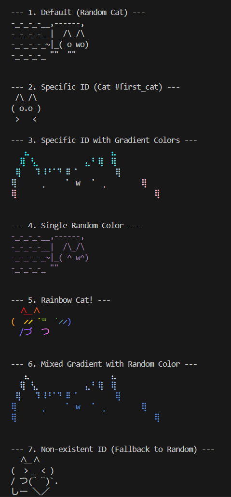

# nekos 🐱

[](https://badge.fury.io/js/nekos)
[](https://opensource.org/licenses/MIT)
[](https://github.com/otoneko110/nekos/actions/workflows/validate-aa.yml)

A simple CLI tool to display cat ASCII art in your console.



## Install

```bash
npm install nekos
```

## Usage

```javascript
// ESM
import nekos from "nekos";
// CJS
const nekos = require("nekos").default;

// Log a random cat
nekos();

// Log a specific cat by ID
nekos({ id: "my_cat" });

// Log a cat with a rainbow gradient
nekos({ colors: "RAINBOW" });

// Log a cat with a single random color
nekos({ colors: "RANDOM" });

// Log a cat with a custom gradient
nekos({ colors: ["#ff00ff", "#00ffff"] });
```

[Example - demo.js](test/demo.js)

## API

`nekos(options)`

### options

Type: `object`

#### id

Type: `string`

The ID of the ASCII art to display (the filename without the `.txt` extension). If not provided, a random cat will be shown.

#### colors

Type: `string | string[]`

Specify the color(s) for the ASCII art.

- **String Keywords:**
  - `'RANDOM'`: Applies a single random solid color.
  - `'RAINBOW'`: Applies a rainbow gradient.
- **String Array:** An array of color strings (e.g., hex codes, color names) to create a custom gradient.

## Contributing

Contributions are welcome! Please see the [Contributing Guidelines](CONTRIBUTING.md) for more details.

---

## nekos 🐱 (日本語)

コンソールに猫のアスキーアートを表示する、シンプルな CLI ツールです。

## インストール

```bash
npm install nekos
```

## 使い方

```javascript
// ESM
import nekos from "nekos";
// CJS
const nekos = require("nekos").default;

// ランダムな猫を表示
nekos();

// IDを指定して特定の猫を表示
nekos({ id: "my_cat" });

// 虹色のグラデーションで猫を表示
nekos({ colors: "RAINBOW" });

// ランダムな単色で猫を表示
nekos({ colors: "RANDOM" });

// カスタムグラデーションで猫を表示
nekos({ colors: ["#ff00ff", "#00ffff"] });
```

[Example - demo.js](test/demo.js)

## API

`nekos(options)`

### options

型: `object`

#### id

型: `string`

表示したいアスキーアートの ID（`.txt`を除いたファイル名）。指定しない場合は、ランダムな猫が表示されます。

#### colors

型: `string | string[]`

アスキーアートの色を指定します。

- **文字列キーワード:**
  - `'RANDOM'`: ランダムな単色を適用します。
  - `'RAINBOW'`: 虹色のグラデーションを適用します。
- **文字列配列:** カスタムグラデーションを作成するための色の配列（例: HEX コード、色名）。

## コントリビューション

コントリビューションを歓迎します！詳細は[コントリビューションガイドライン](CONTRIBUTING.md)をご覧ください。

# Contributors

[](https://github.com/otoneko1102/nekos/graphs/contributors)
