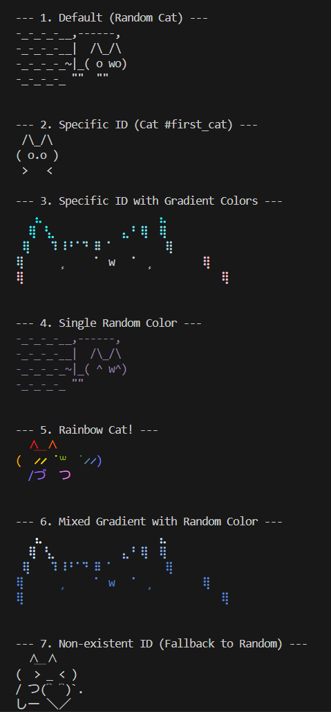

# nekos 🐱

[](https://badge.fury.io/js/nekos)
[](https://opensource.org/licenses/MIT)
[](https://github.com/prettier/prettier)
[](https://github.com/otoneko1102/nekos/actions/workflows/validate-aa.yml)

<a href="https://www.buymeacoffee.com/devuloper" target="_blank"></a>

<a href='https://ko-fi.com/E1E41LY2C9' target='_blank'></a>

**English** | [日本語](./README-ja.md)

A simple CLI tool to display cat ASCII art in your console.



## Install

```bash
npm install nekos
```

## Usage

```javascript
// ESM
import nekos from "nekos";
// CJS
const nekos = require("nekos").default;

// Log a random cat
nekos();

// Log a specific cat by ID
nekos({ id: "my_cat" });

// Log a cat with a rainbow gradient
nekos({ colors: "RAINBOW" });

// Log a cat with a single random color
nekos({ colors: "RANDOM" });

// Log a cat with a custom gradient
nekos({ colors: ["#ff00ff", "#00ffff"] });

// Log a specific cat with two random gradient colors
nekos({ id: "sad_cat", colors: ["RANDOM", "RANDOM"] });
```

[ESM Example - demo.js](test/demo.js)  
[CJS Example - demo.cjs](test/demo.cjs)

---

## CLI Usage

For command line use, either install the package globally or use `npx`.

```bash
# Install globally
npm install -g nekos
```

### Examples

```bash
# Display a random cat
nekos

# Display a specific cat by ID
nekos --id my_cat
nekos -i my_cat

# Display a cat with a rainbow gradient
nekos --colors RAINBOW
nekos -c RAINBOW

# Display a cat with two random gradient colors
nekos --colors RANDOM RANDOM
nekos -c RANDOM RANDOM

# Display a specific cat with a custom gradient
nekos --id sad_cat --colors "#ff00ff" "#00ffff"
nekos -i sad_cat -c "#ff00ff" "#00ffff"

# You can also use npx without a global installation
npx nekos --colors "#ff00ff #00ffff"
npx nekos -c "#ff00ff" "#00ffff"

# Check the current version.
nekos --version
nekos -v
```

---

## API

`nekos(options)`

### options

Type: `object`

#### id

Type: `string`

The ID of the ASCII art to display (the filename without the `.txt` extension). If not provided, a random cat will be shown.

#### colors

Type: `string | string[]`

Specify the color(s) for the ASCII art.

- **String Keywords:**
  - `'RANDOM'`: Applies a single random solid color.
  - `'RAINBOW'`: Applies a rainbow gradient.
- **String Array:** An array of color strings (e.g., hex codes, color names) to create a custom gradient.

## Contributing

Contributions are welcome! Please see the [Contributing Guidelines](CONTRIBUTING.md) for more details.

# Contributors

[](https://github.com/otoneko1102/nekos/graphs/contributors)
